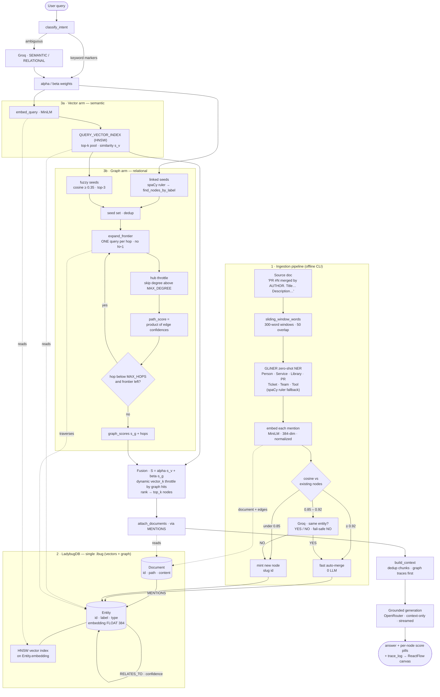
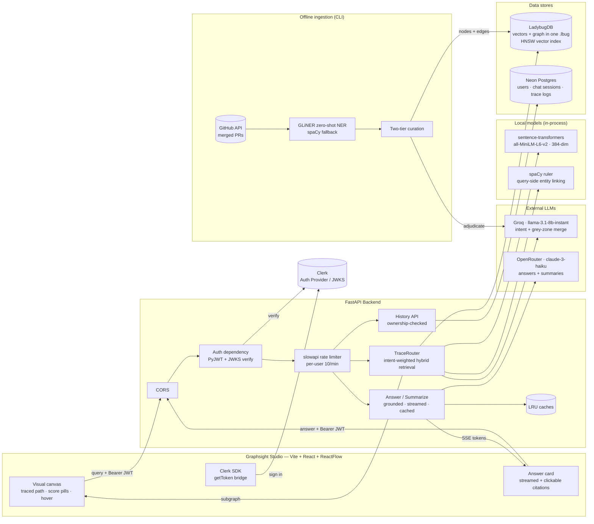
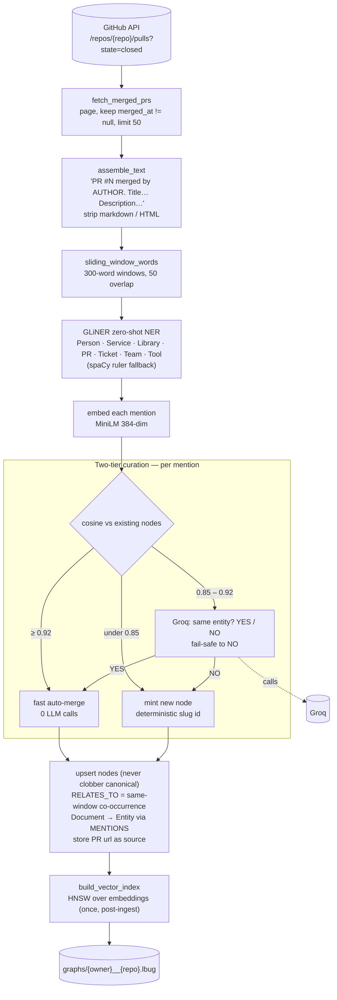
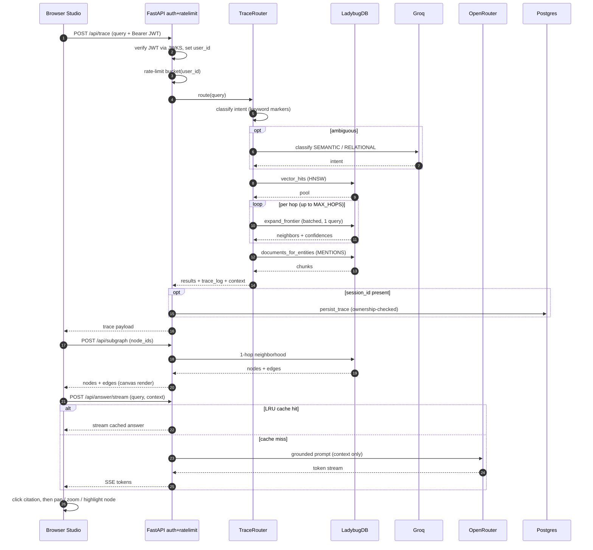
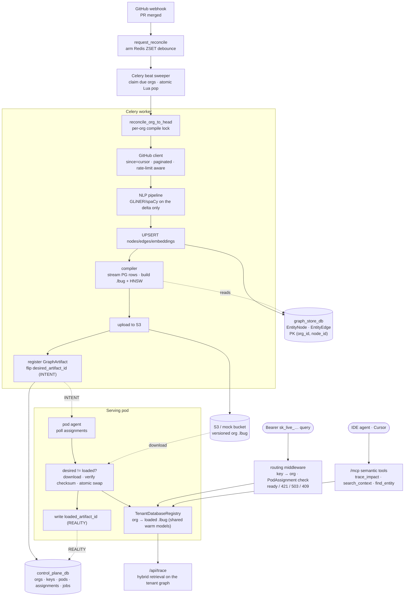
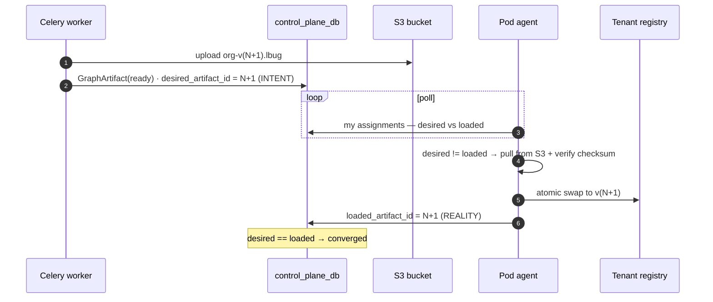

# TraceRAG — The Observable GraphRAG Engine

[](https://www.python.org/downloads/)
[](https://fastapi.tiangolo.com/)
[](https://vitejs.dev/)
[](https://github.com/ladybugdb/ladybug)
[](https://opensource.org/licenses/MIT)

> A local-first, observability-driven GraphRAG pipeline. Vectors **and** graph live in a single
> `.lbug` file — no dual-store sync — behind a two-tier entity-resolution engine, an
> intent-weighted hybrid router, and a visual tracer that lets you *see* why the retriever chose
> what it chose.

---

## I. Overview

Multi-hop retrieval for agents tends to fail for three infrastructural reasons:

1. **Dual-store sync hell** — keeping a graph database and a vector database consistent.
2. **Entity drift** — the *"Janitor Problem"*: unconstrained LLM extraction turns
   `PaymentService`, `payments-v2`, and `pay_svc` into three separate nodes.
3. **Black-box routing** — no insight into why a hybrid retriever weighted a graph edge over a
   semantic chunk.

**TraceRAG** is an orchestration and observability layer (not a new database) that addresses all
three:

- **Zero-sync storage** — semantic vectors (`FLOAT[384]`) and the relational graph live natively
  in one embedded **LadybugDB** file.
- **Two-tier curation** — a cheap vector pass auto-merges obvious duplicates; a local-LLM pass
  (Groq) adjudicates only the ambiguous "grey zone," keeping the graph clean without a human
  janitor.
- **Traceable routing** — every query returns a structured `trace_log` (intent weights, vector
  seeds, graph hops) that **Graphsight Studio** renders so stakeholders can watch the reasoning path.

On top of the retrieval core sits a secured application layer: streamed, grounded answers with
clickable citations, multi-graph hot-swapping, persistent session history, and end-to-end
authentication and rate limiting.

**And a multi-tenant SaaS mode.** Beyond the single-tenant engine, TraceRAG runs as a B2B
platform where each customer org gets a *physically isolated, per-tenant graph* — durable graph
truth in Postgres, compiled into per-org `.lbug` read-artifacts that serving pods pull and
**hot-swap atomically**, fed by a Celery ingestion pipeline (**GitHub → NLP → Postgres → compile →
S3**), with API-key tenancy, gateway-style pod routing, an **MCP agent surface**, and one-call
tenant onboarding. See **§VII**. It is **off by default** (`MULTI_TENANCY_ENABLED` unset); with it
off the engine documented above is completely unchanged.

This document reports what was built **and how it actually performs** — including a candid
benchmark section (§VIII) where the headline thesis did *not* hold on the current data, and why.

---

## For Reviewers — Start Here

**One-sentence pitch:** a graph-backed causal memory tier for AI coding agents — GitHub/Jira
events become a live knowledge graph (vectors + edges in one embedded store), agents query it
over **MCP** instead of re-reading repos, and every answer ships with the exact traced path that
produced it.

**Suggested 15-minute review path:**

1. **The core idea** — §II *Architecture* (one hybrid store, two retrieval arms, intent-fused) and
   §IV *Routing*. The interesting engineering decisions live here and in §III (two-tier entity
   resolution).
2. **Run it** — §IX Quickstart, single-tenant path. Open `http://localhost:5173/studio`, run a
   suggested trace, click a citation chip in the answer, watch the camera pan to the cited node.
   That loop — *claim → traced evidence* — is the product.
3. **The SaaS layer** — §VII (per-tenant compiled artifacts, atomic hot-swap, Celery ingestion,
   MCP surface). `backend/tests/` contains e2e proofs for each stage.
4. **The honest part** — §VIII. The token-reduction thesis did **not** hold on the current
   benchmark data; the section explains why and what the fix is. Read it before forming a verdict.
5. **The standalone packages** — the Studio decoupled from the engine, pip-installable:
   [`graphsight-langgraph`](graphsight-langgraph/README.md) traces *any* LangGraph agent (one
   callback handler) and ships `graphsight-github-trace` (repo → traced run in one command);
   [`graphsight`](graphsight/README.md) serves the bundled UI locally and opens a
   trace with `graphsight trace_state.json` — zero dependencies, no backend.
   Testing this? Start at [BETA.md](BETA.md).

**What's real vs. what's mocked (current state):**

| Layer | Status |
|---|---|
| Retrieval engine (ingest → curate → hybrid route → trace) | **Real**, benchmarked in §VIII |
| Studio UI (trace canvas, streamed answers, citations, sessions) | **Real**, wired to the live API with an offline sample fallback |
| Multi-tenant pipeline (GitHub → Postgres → compile → S3 → pod swap) | **Real**, e2e-tested; off by default via `MULTI_TENANCY_ENABLED` |
| MCP server (`trace_impact` / `search_context` / `find_entity`) | **Real**, mounted in SaaS mode |
| Landing page (`/`) waitlist form | UI real; form logs to console (backend `TODO` marked in code) |
| `archive/dashboard/` Next.js console (GitHub connect, API keys, billing) | UI complete; data mocked — retired to `archive/` after the Graphsight pivot |
| Auth (Clerk JWT, JWKS-verified) + per-user rate limits | **Real**; explicit dev-bypass when `CLERK_ISSUER` unset |
| `graphsight-langgraph/` adapter (LangGraph → Studio, standalone) | **Real**, verified vs `langchain-core 1.5.0`; renders at `/memory/import` with no backend |
| `graphsight-github-trace` CLI (GitHub repo → traced run) | **Real**, tested against `langchain-ai/langgraph` live; lexical + 1-hop retrieval, labeled as such |
| `graphsight` pip package (local viewer, bundled UI) | **Real**, wheel built + smoke-tested; stdlib-only server |

**Known gaps we already know about:** single-writer LadybugDB lock (API must start after ingest;
single worker), in-memory rate-limit counters (Redis URI is the multi-worker path), §VIII accuracy
ceiling (grounding-prompt strictness + benchmark label noise), and the production-hardening TODO
list in §VII.

---

## II. Architecture & Stack

The single idea the whole project is built around: **one hybrid store, queried by two arms
(vector + graph), fused by intent.**



**The GraphRAG story in five lines**
1. **One hybrid store, no sync.** LadybugDB holds *both* the 384-dim embeddings *and* the relationship graph in a single `.lbug` — no graph-DB ↔ vector-DB consistency problem.
2. **Ingestion builds the graph.** Docs → GLiNER typed entities → two-tier curation dedupes → entities, embeddings, and `RELATES_TO` / `MENTIONS` edges land in the store.
3. **Two arms read the same store.** A query fans into a **vector arm** (semantic similarity via HNSW) and a **graph arm** (multi-hop traversal over `RELATES_TO`, scoring paths by the product of edge confidences).
4. **Intent decides the blend.** The classifier sets `alpha/beta`; fusion combines them as `S = alpha·s_v + beta·s_g`. "Who caused X?" leans graph; "explain X" leans vector.
5. **Why it beats plain RAG.** Embeddings find *similar text*; the graph arm follows *relationships* — surfacing the PR / person / service connected to the answer even when the words don't match.

### Stack

| Layer | Technology | Role |
|---|---|---|
| **Embeddings** | `sentence-transformers` · `all-MiniLM-L6-v2` | 384-dim sentence vectors (cosine) |
| **Entity extraction** | **GLiNER** (designed) / **spaCy** (current fallback) | Zero-shot domain NER; see §VIII for why spaCy is active |
| **Storage** | **LadybugDB** (embedded, Kùzu-lineage) | Single-file hybrid vector + graph store with a native HNSW `VECTOR` extension |
| **LLM — extraction / intent** | **Groq** · `llama-3.1-8b-instant` | Grey-zone entity disambiguation + router intent fallback |
| **LLM — generation** | **OpenRouter** · `anthropic/claude-3-haiku` (default) | Grounded plain-language answers + node summaries |
| **API** | **FastAPI** + Uvicorn | Headless backend: trace, subgraph, answer, graphs, history |
| **Concurrency** | read connection pool + bounded embed `ThreadPoolExecutor` | parallel graph/vector reads; embeds off the request threads |
| **Auth** | **Clerk** (frontend) + **PyJWT / JWKS** (backend) | Networkless session-token verification; dev-bypass when unconfigured |
| **History** | **Neon Postgres** via **SQLModel** | Users, chat sessions, persisted trace logs |
| **Frontend** | **Vite + React + ReactFlow** · Tailwind / shadcn | Graphsight Studio — visual query tracer |
| **Observability** | **Sentry** (backend + frontend) | Full-stack error + performance tracing (opt-in via DSN) |
| _**SaaS platform (§VII)**_ | _active only when_ | `MULTI_TENANCY_ENABLED` |
| **Task queue / debounce** | **Celery** + **Redis** | Incremental-compute orchestration + ZSET debounce-coalesce |
| **Control plane / graph store** | **Postgres** (two DBs) via SQLModel | Orgs·keys·pods·assignments·jobs / durable EntityNode·EntityEdge |
| **Artifact storage** | **AWS S3** (boto3, multipart) · local mock | Versioned per-org `.lbug` artifacts |
| **Agent interface** | **MCP** (Model Context Protocol) SDK | Typed semantic tools for IDE agents at `/mcp` |

### Repository layout

```
backend/
├── api.py                  # FastAPI app + lifespan (warmup, pools, MCP mount, pod agent)
├── auth.py                 # Clerk JWT verify + tenant API-key resolution + org context
├── cache.py                # bounded OrderedDict LRU for the answer / summary caches
├── ratelimit.py            # per-user slowapi limiter (keyed by the verified user id)
├── database.py             # SQLModel engine / session for the Postgres history store
├── storage.py              # artifact store: AWS S3 (boto3) or local mock  ← SaaS
├── registry.py             # TenantDatabaseRegistry: per-org loaded graph + atomic swap  ← SaaS
├── pod_agent.py            # REALITY loop: poll assignments, pull + swap tenant graphs  ← SaaS
├── mcp_server.py           # MCP server: trace_impact / search_context / find_entity  ← SaaS
├── middleware/
│   └── routing.py          # gateway simulation: org→pod check, 421 misdirected  ← SaaS
├── models/
│   ├── history.py          # User / ChatSession / TraceLog tables
│   ├── control_plane.py    # Organization·Repository·GraphArtifact·IngestJob·Pod·PodAssignment·ApiKey  ← SaaS
│   └── graph_store.py      # EntityNode / EntityEdge (composite PK (org_id, node_id)) + UPSERT  ← SaaS
├── routers/
│   ├── history.py          # session + trace-log endpoints (ownership-checked)
│   └── onboarding.py       # POST /api/admin/onboarding/provision (X-Admin-Secret)  ← SaaS
├── worker/                 # ← SaaS: Celery ingestion + orchestration
│   ├── celery_app.py       # Celery app (Redis broker) + beat schedule
│   ├── settings.py         # broker, debounce window, sweep cadence, compile lock
│   ├── debounce.py         # Redis ZSET debounce-coalesce (atomic Lua claim)
│   ├── tasks.py            # request_reconcile · sweeper · reconcile_org_to_head (5 phases)
│   └── ingestion/
│       ├── github_client.py  # real GitHub delta fetch (httpx, paginated, rate-limit aware)
│       ├── pipeline.py       # delta → NLP → embed → UPSERT to graph store
│       └── compiler.py       # stream PG rows → build .lbug + HNSW (worker-side)
├── tracerag/
│   ├── config.py           # single source of truth: thresholds, weights, models, tenancy flags
│   ├── db.py               # LadybugDB: read connection pool + write conn, HNSW, graph queries
│   ├── extract.py          # GLiNER (→ spaCy fallback) + sliding window + LRU query cache
│   ├── curation.py         # two-tier resolution (vector fast-merge + Groq grey-zone)
│   ├── router.py           # intent classify + dual-stream fusion + async aroute + embed pool
│   ├── llm.py              # Groq / OpenRouter client factories
│   └── integrations/langchain.py   # drop-in BaseRetriever
├── scripts/
│   ├── ingest.py · ingest_github.py · benchmark.py · stress_test.py
│   └── generate_dry_run_artifact.py   # tiny real .lbug for the serve dry-run  ← SaaS
└── tests/                  # ← SaaS: e2e proofs (torch-free where possible)
    ├── test_e2e_serve.py         # dynamic tenant load + model-sharing + real query
    ├── test_ingest_pipeline.py   # GitHub → NLP → Postgres; cursor idempotency; isolation
    ├── test_compiler.py          # Postgres truth → queryable .lbug (+ HNSW)
    ├── test_github_client.py     # pagination · normalization · rate limits · cursor
    └── test_onboarding.py        # admin guard · provision txn · key auth · reconcile armed

infra/postgres/init.sql     # creates control_plane_db + graph_store_db on first boot  ← SaaS
docker-compose.yml          # db + redis + api + worker + beat on one bridge network  ← SaaS
.env.example                # full-stack environment template

frontend/                   # Vite + React 18 — the product surface (landing + studio)
└── src/
    ├── components/
    │   ├── landing/        # marketing/waitlist page at `/` (light neubrutalist system)
    │   ├── memory/         # Graphsight Studio at `/studio`: CommandPanel · GraphCanvas ·
    │   │                   #   InspectorPanel · AppLayout (+ DESIGN.md, the design system)
    │   ├── left|right/     # legacy dashboard panes, kept at `/classic` for reference
    │   └── auth/           # Clerk sign-in/up pages
    ├── lib/                # api client, auth-token bridge, dagre layout, Clerk helpers
    ├── data/               # mock trace for the offline fallback + /memory/preview demo
    └── types/              # shared TraceState / node / edge types

graphsight-langgraph/       # standalone adapter: trace any LangGraph agent (one callback
                            #   handler, depends only on langchain-core) → AgentTrace v0.1 →
                            #   Studio render at /memory/import — no TraceRAG backend needed
                            #   + `graphsight-github-trace`: GitHub repo → trace in one command
graphsight/                 # pip-installable local viewer: bundled Studio UI + stdlib server;
                            #   `graphsight trace_state.json` opens the trace, zero deps
BETA.md                     # "Beta for Friends" — 10-minute test script + feedback questions

docs/                       # demo scripts, deploy notes, stress results, planning docs
archive/                    # retired deliverables: standalone landing page, Next.js
                            #   customer console (UI complete, data mocked), scratch files
hf-space/                   # HuggingFace Space deployment (own git remote)
```

### Data model

A single generic `Entity` node table (`id, label, type, embedding`) keeps the schema dynamic
across all entity labels. `Document` nodes store one **sliding-window chunk** each (with raw
`content` for generation). Edges: `Document -[MENTIONS]-> Entity` and `Entity -[RELATES_TO]->
Entity` (only between entities co-occurring in the *same* window — no document-wide hairball).

### High-Level Design (HLD)



- Every request crosses **CORS → Auth (JWT verify against Clerk's JWKS) → per-user rate limit** before any business logic.
- The retrieval core (`TraceRouter`) reads the **single hybrid store (LadybugDB)**, embeds locally (no network for embeddings), and calls **Groq** only for the cheap intent decision.
- Generation is a **separate, cached, streamed** path to **OpenRouter** — off the retrieval critical path. **History** is independent (Postgres), and **ingestion is fully offline**.

### Low-Level Design — query & retrieval pipeline (`POST /api/trace`)

```mermaid
flowchart TB
  START(["POST /api/trace<br/>{ query, top_k, session_id }"])

  subgraph SEC["Security chain"]
    direction TB
    A1["extract Bearer token"] --> A2["JWKS: resolve public key by kid"]
    A2 --> A3["verify RS256 sig + exp / iss / azp"]
    A3 --> A4["sub → request.state.user_id"]
    A4 --> A5["slowapi: bucket = user_id<br/>10/min else HTTP 429"]
  end

  START --> A1
  A5 --> I1

  subgraph ROUTE["TraceRouter.route — recall"]
    direction TB
    I1["classify_intent<br/>keyword markers (free)"] -->|ambiguous| I2["Groq fallback<br/>SEMANTIC / RELATIONAL"]
    I1 --> W["alpha, beta weights"]
    I2 --> W
    W --> E["embed_query<br/>MiniLM 384-dim, normalized"]
    E --> V["vector_hits<br/>CALL QUERY_VECTOR_INDEX (HNSW)<br/>pool = (id, similarity)"]
    V --> S1["linked seeds<br/>spaCy ruler → find_nodes_by_label"]
    V --> S2["fuzzy seeds<br/>cosine ≥ min_sim, top-N"]
    S1 --> S["seeds (dedup)"]
    S2 --> S
  end

  S --> B1

  subgraph BFS["graph_stream — multiplicative BFS, per hop"]
    direction TB
    B1["expand_frontier(frontier)<br/>ONE query per hop (no N+1)"] --> B2["hub throttle:<br/>skip nodes with degree above MAX_DEGREE"]
    B2 --> B3["path_score = product of edge confidences<br/>keep max score per node"]
    B3 --> B4{"more hops left<br/>and frontier not empty?"}
    B4 -->|yes| B1
    B4 -->|no| BOUT["graph_scores + hops"]
  end

  subgraph ASSEMBLE["Fuse & assemble"]
    direction TB
    F["fuse: S = alpha·s_v + beta·s_g<br/>throttle vector_k by graph hits<br/>rank → top_k"]
    F --> D["attach_documents<br/>via MENTIONS edges"]
    D --> C["build_context<br/>dedup chunks · traces first"]
  end

  BOUT --> F
  C --> OUT(["results + trace_log + context"])

  E -. uses .-> EMB[("MiniLM (local)")]
  V -. reads .-> LBUG[("LadybugDB")]
  B1 -. reads .-> LBUG
  D -. reads .-> LBUG
  I2 -. calls .-> GROQ[("Groq")]

  OUT --> SUB["POST /api/subgraph<br/>1-hop neighborhood → ReactFlow canvas"]
  OUT -. "if session_id" .-> PERSIST[("persist_trace → Postgres<br/>ownership-checked")]
  OUT --> ANS["POST /api/answer/stream"]

  subgraph GENF["Answer generation"]
    direction TB
    G1{"LRU hit?<br/>key = (query, context)"} -->|hit| G3["stream cached text"]
    G1 -->|miss| G2["OpenRouter (stream)<br/>grounded, context-only prompt"]
    G2 --> G3
  end

  ANS --> G1
  G3 --> TOK["SSE tokens → Answer card<br/>→ clickable citations"]
```



1. **Security first.** Auth + rate limit run as dependencies *before* the handler; the verified `sub` is stashed on `request.state` so the limiter keys per user.
2. **Intent is two-tier.** Keyword markers decide most queries for free; only ambiguous ones pay a fast Groq call. Intent sets the fusion weights.
3. **Two recall arms.** Vector arm hits HNSW; graph arm seeds from links + fuzzy hits, then runs a **batched BFS** (one DB query per hop), scoring paths by the product of edge confidences, with hubs throttled.
4. **Fusion + assembly.** `S = alpha·s_v + beta·s_g`; documents pulled via `MENTIONS`, de-duplicated into the final context.
5. **Generation is decoupled.** Canvas (`/api/subgraph`) and streamed answer (`/api/answer/stream`, LRU-cached) are separate calls — the LLM never blocks retrieval.

### Low-Level Design — ingestion & curation pipeline (offline)



- Each merged PR becomes one document; entities are extracted **per sliding window** so long bodies don't lose tail entities.
- The **"Janitor"** is the two-tier curation: cosine auto-merges obvious duplicates; only the grey zone (0.85–0.92) costs a Groq call, which **fails safe to NO**.
- The HNSW index is built **once after** ingestion (the index is static and can't be mutated while embeddings are written).

### End-to-end request sequence



### Component reference

| Component | Responsibility | Key files |
|---|---|---|
| TraceRouter | Intent classification, dual-arm retrieval, fusion, context assembly | `tracerag/router.py` |
| TraceDB | LadybugDB schema, HNSW, batched graph queries | `tracerag/db.py` |
| EntityExtractor | GLiNER (→ spaCy) over sliding windows | `tracerag/extract.py` |
| CurationEngine | Two-tier entity resolution | `tracerag/curation.py` |
| Auth | Clerk JWT verification (PyJWT + JWKS) + dev-bypass | `auth.py` |
| Rate limiter | Per-user slowapi limiter | `ratelimit.py` |
| LRU caches | Bounded answer / summary caches | `cache.py` |
| History | Sessions + trace logs, ownership-checked | `routers/history.py`, `models.py` |
| API | FastAPI app + endpoints | `api.py` |
| Studio | Visual tracer, answer card, citations | `frontend/src/` |

---

## III. Entity Resolution — The Two-Tier "Janitor"

Every extracted mention is embedded and compared (cosine) against already-resolved nodes. The
decision is tiered to spend LLM budget only where it matters:

| Similarity | Action | Cost |
|---|---|---|
| **≥ 0.92** | **Fast Mode** — auto-merge into the existing canonical node | 0 LLM calls |
| **0.85 – 0.92** | **Deep Merge** — ask Groq *"Are 'X' and 'Y' the exact same entity? YES/NO"* (`temperature=0`) | 1 Groq call |
| **< 0.85** | Mint a new node (deterministic slug id) | 0 LLM calls |

Canonical nodes are **never** overwritten on merge (a later, noisier surface form can't clobber
the clean label/embedding), and Groq failures **fail-safe to NO** — the engine prefers a duplicate
node over a hallucinated merge.

> **Implementation note.** This LadybugDB build's HNSW index is *static* (the indexed property
> can't be mutated once the index exists), so curation does its dedup search **in-memory**
> (normalized-cosine) during ingest, and the persistent HNSW index is built **once afterward** for
> query-time retrieval.

**Observed on the test corpus (7 docs, 255 raw mentions):**

| Metric | Value |
|---|---|
| Raw extracted mentions | 255 |
| Canonical nodes after curation | **135** |
| Entity consolidation | **≈ 47%** |
| Fast-mode auto-merges (≥0.92) | 117 |
| Groq grey-zone adjudications (0.85–0.92) | 12 (→ 3 merged, 9 kept distinct) |

---

## IV. Intent-Based Hybrid Routing

The router never uses static weights. It classifies query intent, then fuses two retrieval streams:

```
S = α · s_v + β · s_g          (α + β = 1)
```

- `s_v` = vector similarity (`1 − cosine_distance`) from the HNSW index.
- `s_g` = graph **PathScore** — the product of edge confidences along the traversal from the vector
  "seed" nodes (seeds score `1.0`).

**Dynamic weighting:**

| Intent | α (vector) | β (graph) | Trigger |
|---|---|---|---|
| **Semantic / conceptual** | **0.80** | 0.20 | keywords (*explain, architecture, overview…*) |
| **Relational / multi-hop** | 0.15 | **0.85** | keywords (*who, caused by, which PR, depends on…*) |
| *ambiguous* | — | — | Groq fallback classifier (`SEMANTIC` / `RELATIONAL`) |

The graph traversal is a batched, multiplicative-confidence BFS: each hop expands the **entire
frontier in one query** (no N+1), and hub super-nodes above a degree threshold are reached but not
traversed through, so the frontier can't explode into a hairball. Every call emits a `trace_log`
consumed by the UI:

```json
{
  "intent": { "alpha": 0.15, "beta": 0.85, "type": "relational" },
  "execution_path": {
    "vector_seeds": ["paymentservice-service", "..."],
    "graph_hops":  [{ "from_id": "...", "to_id": "...", "confidence": 0.9 }]
  },
  "metrics": { "total_nodes_evaluated": 18 }
}
```

---

## V. Application Layer — Graphsight Studio

Retrieval is half the loop; the Studio closes it with generation, exploration, and observability
over the retrieved subgraph.

**Product surface & routes** (Vite app, `npm run dev` → `localhost:5173`):

| Route | What it is |
|---|---|
| `/` | Waitlist landing page — hero, animated marquee, interactive code showcase, use-case bento, pricing |
| `/studio` | **Graphsight Studio** — the memory tool itself (below) |
| `/memory/preview` | Studio on mock data with simulated tracing; demos with no backend |
| `/memory/import` | Drop/paste a `trace_state.json` from `graphsight-langgraph` — the Studio renders an external agent's run, no backend |
| `/classic` | The previous dashboard UI, kept for comparison |

The landing page and Studio share one design system (documented in
`frontend/src/components/memory/DESIGN.md`): light, white surfaces, `#131316` ink and borders,
hard offset shadows, Space Grotesk display type, a lime `#C8F169` highlight, and emerald for all
interactive/traced states — so color is semantic on the canvas: **emerald shadow = on the traced
path, lime shadow = citation focus, gray = background context**.

**The Studio shell** is deliberately *not* a chatbot: a collapsible command sidebar
(⌘K-focusable trace input, streamed "Recall" answer with citation chips, sessions, suggested
traces, recent queries, and a persistent latency readout), a full-bleed React Flow canvas, and a
floating inspector that slides in on node click with the exact context snippet, retrieval
scores, and provenance. Keyboard: `⌘K` search, `⌘\` sidebar, `Esc` inspector. While a query
runs there is no spinner — nodes pulse a sonar ring and a light beam sweeps the canvas until the
traced path lights up.

**Visual observability.** The backend is fully decoupled from the UI: `POST /api/trace` returns the
ranked nodes *and* the `trace_log`, and `POST /api/subgraph` returns a bounded neighborhood
(requested nodes + 1-hop neighbors + interconnecting edges) so the browser never renders the whole
graph. The canvas shows which nodes came from the **vector** arm vs the **graph** arm, the exact
**α / β** the router chose, the **hop path** the traversal walked, and a dimmed 1-hop context around
the active trace. When a hybrid retriever makes a surprising choice, you can *see* why.

**Grounded answers (streamed).** `POST /api/answer/stream` produces a concise, plain-language answer
from the **retrieved context only** (OpenRouter), streamed token-by-token and cached per
`(query, context)`. If the context doesn't cover the question, the model is instructed to say so
rather than guess.

**Clickable citations.** Entity mentions in the answer (people, PRs, services) render as chips that
pan, zoom, and highlight the matching node on the canvas — turning a claim into traceable evidence.
Mentions are matched with word-boundary–safe lookarounds, so labels such as `PR #5818` resolve
correctly without false matches inside longer words.

**Graph-aware suggestions.** `GET /api/suggestions` derives example questions from the active graph's
hub entities, so users only ask what the loaded graph can actually answer.

**Multi-graph hot-swap.** `GET /api/graphs` + `POST /api/graphs/switch` change the active `.lbug` at
runtime without a restart — warm models stay resident. The frontend persists the selection across
reloads.

**Session history.** Chat sessions and their `trace_log`s persist to Postgres and re-hydrate the
canvas on demand, with no LLM call on replay.

---

## VI. Security & Operational Hardening

The billed and user-data surface is protected end-to-end:

- **Authentication.** Clerk session JWTs are verified networklessly against Clerk's JWKS (PyJWT,
  RS256) — signature, expiry, issuer, and authorized-party are all checked, with no per-request
  network call. The verified `sub` claim is the user id. With `CLERK_ISSUER` unset, the API runs in
  an explicit **dev-bypass** mode so local development and CI are unaffected.
- **Ownership (IDOR-closed).** History endpoints and trace persistence derive the user from the
  token and enforce per-session ownership, instead of trusting any client-supplied id.
- **Per-user rate limiting.** The LLM endpoints (`/api/answer`, `/api/answer/stream`,
  `/api/summarize`) are capped per user via slowapi (default `10/min`), keyed by the verified user
  id with an IP fallback. `scripts/ratelimit_test.py` burst-verifies the cap holds exactly — a
  25-request simultaneous burst resolves to **10×`200` + 15×`429`**.
- **Bounded caches.** The answer and summary caches are fixed-capacity LRU structures, so a
  long-running server cannot leak memory.

> **Operational note.** slowapi's default counter is in-memory and per-process; run the API
> single-worker for the rate limit to behave as one shared bucket. A Redis `storage_uri` is the
> path to multi-worker — see `ratelimit.py`.

---

## VII. The Multi-Tenant SaaS Platform (Cell Model)

Enable with `MULTI_TENANCY_ENABLED=True`. With it off, every request maps to one default org
served by the single warm local graph and nothing below applies — the engine in §I–§VI is
untouched.

**The one idea:** *Postgres is the durable truth; each `.lbug` is a compiled, versioned,
disposable read-artifact.* Ingestion writes graph content to Postgres; a worker compiles it into an
optimized `.lbug`; serving pods pull that file and **atomically swap** it to answer queries.
Durability (Postgres) and read-performance (the artifact) are decoupled — lose a `.lbug`,
recompile it from the truth.

### The Cell Model
- **One `.lbug` per organization** ("cell"). All of an org's repos compile into the *same* file,
  so cross-repo traversal (a PR in repo A → a ticket in project C) is a **native graph edge**, not
  a federation query.
- **Physical isolation is the security boundary.** A tenant's queries open a different file; there
  is no shared table to leak across. In the graph store this is enforced structurally: `EntityNode`
  has the **composite primary key `(org_id, node_id)`**, so the same `node_id` can exist under two
  orgs with zero collision and every read is org-scoped by construction.
- **Two isolated Postgres databases:** `control_plane_db` (orchestration) and `graph_store_db`
  (durable content). Created on first boot by `infra/postgres/init.sql`.

### End-to-end: from a merged PR to a served query



### Ingestion — debounce, incremental compute, compile
- **Webhook → debounce.** A merge doesn't compile immediately; it arms a Redis **ZSET debounce**
  (`worker/debounce.py`) scored by an *effective deadline* `min(now+window, first+max_wait)`. A
  burst of PRs **coalesces into one compile**; a Celery **beat** sweeper atomically claims due orgs
  (Lua pop, race-free) and enqueues `reconcile_org_to_head`. A per-org compile lock serializes
  compiles without serializing the cheap fetch.
- **Incremental compute.** The real **GitHub client** (`worker/ingestion/github_client.py` — httpx,
  Link-header pagination, `?since=cursor`, typed rate-limit exceptions the worker retries on)
  fetches only the delta; the **pipeline** (`pipeline.py`) runs GLiNER/spaCy on that delta and
  **UPSERTs** nodes/edges/embeddings into `graph_store_db`. Entities and authors are org-shared
  nodes, so the same service mentioned in two repos merges into one node — the seed of cross-repo
  traversal.
- **Compile.** The **compiler** (`compiler.py`) streams the org's rows from Postgres with a
  server-side cursor (RAM stays flat), writes a fresh `.lbug`, and builds the **HNSW index** — the
  CPU-heavy step, **on the worker, never on a serving pod** — then uploads to S3 (`storage.py`,
  boto3 multipart; local file mock for dev/CI).

### Serving — the "Intent vs. Reality" state machine
The worker registers the artifact and flips the org's **`desired_artifact_id`** (INTENT). Each pod
runs a **pod agent** (`pod_agent.py`) polling its `PodAssignment` rows; on `desired != loaded` it
downloads the artifact, **verifies the checksum**, and performs an **atomic in-process swap**
(`registry.py` — a locked pointer flip that shares the one warmed embedder/spaCy across tenants, so
a new tenant costs ≈0 model RAM), then writes **`loaded_artifact_id`** (REALITY). The desired≠loaded
gap *is* the self-healing transition window; a pod that dies mid-pull never advances REALITY and
simply retries.



### Multi-tenant auth & gateway-style routing
- **API keys.** Each org has an `sk_live_…` key; **only its SHA-256 is stored**.
  `auth.resolve_org_from_token` maps a Bearer key → `org_id` with a constant-time compare and a
  revocation check.
- **Gateway simulation** (`middleware/routing.py`). Tenant-scoped routes are gated on this pod's
  assignment for the org: **ready here → pass**; still loading → **`503`**; served by a *different*
  pod → **`421 Misdirected Request`** (advertising the correct pod, exactly how a stateless gateway
  reroutes); unassigned → **`409`**. The resolved org then selects that tenant's loaded graph from
  the registry — an org can never touch another's file.
- **Org context** flows to the MCP tools via a request-scoped `ContextVar`, so the same tenancy
  applies to the agent surface.

### The agent surface (MCP)
`mcp_server.py` mounts a **Model Context Protocol** server at `/mcp` exposing three typed,
read-only **semantic tools** — never raw Cypher — over the hybrid engine:

| Tool | Use |
|---|---|
| `trace_impact(entity_name, max_hops)` | "What breaks if I change X?" — confidence-decayed blast radius with citations |
| `search_context(query)` | "Why does X exist / how does it work?" — hybrid retrieval passages with citations |
| `find_entity(name)` | Disambiguate a name to the graph's actual entities |

An IDE agent (Cursor, Claude Desktop) gets a **cited, cross-repo** answer because it's one graph.
Guards (hop/degree/`top_k`) are enforced server-side; the seed node is expanded generously while
deeper hops keep hub-suppression.

### Control-plane schema (`control_plane_db`)

| Table | Purpose |
|---|---|
| **Organization** | the tenant; holds `desired_artifact_id` (INTENT) |
| **Repository** | repos under an org; `last_synced_cursor` (incremental engine) + per-repo `github_token` |
| **GraphArtifact** | append-only registry of compiled `.lbug` versions in S3; `entity_count` (watch the ~1M/org ceiling) |
| **IngestJob** | Celery orchestration + audit; a partial-unique index enforces **one active job per org** |
| **Pod** | the serving fleet (fungible, sticky) |
| **PodAssignment** | sticky org→pod; `loaded_artifact_id` (REALITY) — the routing ground truth |
| **ApiKey** | per-org key; SHA-256 stored, `revoked_at` for instant kill |

### One-call onboarding
`POST /api/admin/onboarding/provision` (guarded by an `X-Admin-Secret` header vs `ADMIN_SECRET_KEY`;
**fail-closed** — unset secret → `503`) creates **Organization + ApiKey + Repository + PodAssignment
in one transaction** and arms the first ingestion, returning the raw `sk_live_…` key **exactly
once**. That is the entire "sign up a tenant" flow.

### Status & production-hardening TODO
Every layer above is **built and test-proven** (`backend/tests/`), end-to-end on real files — the
only mock left in the data path was retired when the real GitHub client landed. Not yet done, and
explicitly out of scope so far:
- **Secrets at rest** — `Repository.github_token` is stored plaintext; encrypt / move to a secrets
  manager, and rotate any keys shared during development.
- **Multi-pod scheduler** — onboarding pins every org to the single `POD_ID`; spreading tenants
  across a real fleet needs a placement policy (the pod agent already obeys whatever assignments
  exist).
- **Real deploy** — the stack runs under docker-compose (below); production means managed Postgres,
  Redis, an S3 bucket, and a pod fleet behind a real gateway.

---

## VIII. Benchmarks & Known Constraints (read this carefully)

We evaluate with an **LLM-as-a-judge** (Groq) over 10 queries (5 semantic, 5 relational), comparing
the hybrid router's context against a **pure-vector baseline**, and measuring a token "sufficiency"
judgment. The honest results:

```
Category      Queries   Hybrid Tok   Baseline Tok   Reduction   Accuracy
─────────────────────────────────────────────────────────────────────────
semantic            5       3233.4         3189.0       -1.4%       0.0%
relational          5       3883.2         3837.0       -1.2%      40.0%
─────────────────────────────────────────────────────────────────────────
OVERALL            10       3558.3         3513.0       -1.3%      20.0%
```

These numbers are **not** flattering, and they are real. Two findings dominate:

### Token reduction ≈ 0% (−1.3%)
On this **dense, single-domain corpus**, the top-k vector chunks and the top-k graph-traversed
chunks **heavily overlap** — the graph surfaces largely the *same* evidence the vectors already
found. After **global chunk deduplication**, the two contexts reach **parity**; the residual −1.3%
is simply the small `Entity: <label> (<type>)` metadata the hybrid adds on top of the identical
chunk set. (This replaced an earlier −70% result that was a genuine bug — chunks were repeated once
*per mentioning entity*; global dedup fixed it.)

### Accuracy capped at 20% — two avoidable causes
1. **NER fallback to spaCy.** GLiNER (the designed zero-shot extractor) is blocked on this machine
   by an `onnxruntime` DLL load failure. The active spaCy fallback extracts the wrong things for
   this domain — markdown artifacts, `CARDINAL` numbers, raw timestamps — so the graph is **noisy**,
   and the judge correctly rates much of the retrieved context as insufficient.
2. **Aggressive truncation for rate limits.** Groq's free tier caps us at 6,000 TPM, so the judge
   sees only the first 5,000 characters of context. Relevant evidence past that cutoff is invisible
   to the judge, artificially depressing accuracy.

### Treat this as a baseline, not a verdict
The pipeline is **correct and fully operational** — these are *data-quality* and *environment*
constraints, not logic defects. The path to the originally-hypothesized gains:

- **Unblock GLiNER** (fix `onnxruntime` / install the MSVC redistributable) → clean domain entities
  → a meaningful graph and far higher judge accuracy.
- **Raise the judge token budget** (paid Groq tier or a local model) → remove the 5k truncation.
- **Re-scope the token-reduction comparison** to naive over-retrieval (where graph precision
  actually saves tokens), rather than equal-k vector retrieval.

---

## IX. Quickstart

### Single-tenant engine (local)

```powershell
# 1. backend install
cd backend
pip install -r requirements.txt
python -m spacy download en_core_web_sm        # fallback NER
#  .env: set GROQ_API_KEY + OPENROUTER_API_KEY               (see .env.example)
#  optional: CLERK_ISSUER + APP_DATABASE_URL to enable auth + history
#  (leave CLERK_ISSUER unset for an un-authed local dev-bypass)

# 2. ingest your datasets/ (writes memory.lbug, builds the HNSW index)
python scripts/ingest.py --datasets ./datasets --reset

# 3. evaluate (optional)
python scripts/benchmark.py            # -> results.csv + summary table

# 4. serve the API  (run AFTER ingest — single-writer DB lock; single-worker)
uvicorn api:app --reload --port 8000   # docs at /docs

# 5. run the frontend (in a second shell)
cd ../frontend
npm install
npm run dev
#   http://localhost:5173/          → landing page
#   http://localhost:5173/studio    → Graphsight Studio (live API, sample fallback)
#   http://localhost:5173/memory/preview → mock-data demo, no backend needed
#   http://localhost:5173/memory/import  → render an external LangGraph trace (graphsight-langgraph)
```

### Multi-tenant SaaS mode (docker-compose)

Brings up Postgres (both DBs), Redis, the API, the Celery worker, and the beat scheduler on one
bridge network, then provisions a tenant and serves a query end-to-end.

```bash
# 1. configure — set at minimum ADMIN_SECRET_KEY, GITHUB_TOKEN, OPENROUTER_API_KEY
cp .env.example .env

# 2. bring the stack up (db + redis + api:8000 + worker + beat)
docker compose up --build

# 3. provision a tenant — save the returned sk_live_… key (shown once)
curl -X POST localhost:8000/api/admin/onboarding/provision \
  -H "X-Admin-Secret: $ADMIN_SECRET_KEY" -H "Content-Type: application/json" \
  -d '{"tenant_name":"Acme","repo_name":"tiangolo/fastapi"}'
#    → within ~2 min: worker ingests the repo (GitHub→NLP→Postgres→compile→S3)
#      and the pod agent atomically swaps the tenant's graph in

# 4. query as the tenant (routed by the API key to its pod + graph)
curl -X POST localhost:8000/api/trace \
  -H "Authorization: Bearer sk_live_…" -H "Content-Type: application/json" \
  -d '{"query":"what changed in dependency injection?"}'
```

> Storage defaults to a shared local volume (`TRACERAG_STORAGE_PROVIDER=local`); set it to `s3`
> with `TRACERAG_S3_BUCKET` + `AWS_*` to use a real bucket. Point a repo at any public GitHub repo;
> with no `GITHUB_TOKEN` the fetcher falls back to a deterministic mock batch.

### API surface

| Method | Endpoint | Auth | Returns |
|---|---|---|---|
| POST | `/api/trace` | token | ranked nodes + `page_content` + `trace_log` + `context` |
| POST | `/api/subgraph` | — | `{ nodes, edges }` (1-hop bounded) |
| POST | `/api/answer` · `/api/answer/stream` | token + rate-limit | grounded answer (blocking / streamed) |
| POST | `/api/summarize` | token + rate-limit | one-sentence node summary |
| GET · POST | `/api/graphs` · `/api/graphs/switch` | — | list / hot-swap the active graph |
| GET | `/api/suggestions` | — | graph-aware example questions |
| POST · GET | `/api/sessions` · `/api/sessions/{id}/traces` | token (owner) | create / list sessions, fetch trace logs |
| GET | `/api/health` | — | `{ status, nodes }` |
| POST | `/api/admin/onboarding/provision` | `X-Admin-Secret` | _SaaS:_ provision Org+Key+Repo+Assignment, arm first sync → `sk_live_…` |
| — | `/mcp` | Bearer (org key) | _SaaS:_ MCP server — `trace_impact` · `search_context` · `find_entity` |

> **Operational note.** LadybugDB is a single-writer embedded store. Don't run `ingest.py` and
> `uvicorn` against the same `.lbug` simultaneously — ingest first, then serve. The API loads the
> data snapshot at startup; re-ingest → restart the server to refresh.

---

## License

MIT.
