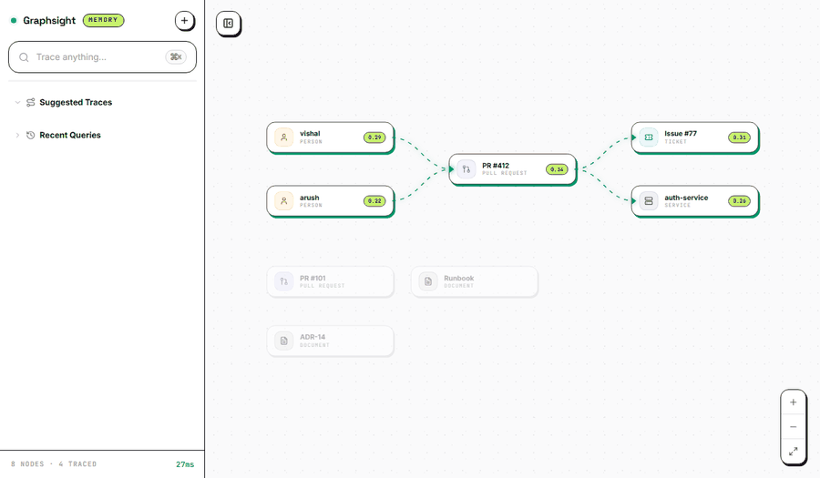
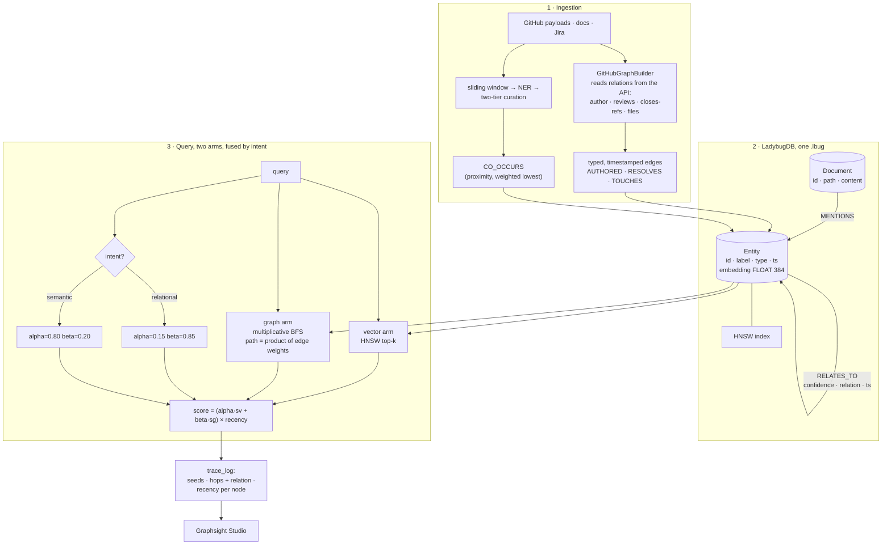

# Graphsight

**See what your agent retrieved, and what it actually used.**

[](https://pypi.org/project/graphsight/)
[](https://pypi.org/project/graphsight-langgraph/)
[](https://www.python.org/downloads/)
[](https://opensource.org/licenses/MIT)

Your agent retrieved twelve documents and answered from three. The other nine cost you tokens,
latency, and a wider surface for the model to go wrong on. Nothing in your stack tells you
which nine.

Graphsight traces a run, then marks every retrieved item **overlaps the answer** or **no lexical
trace in answer**, scored by lexical overlap against the final answer. No LLM re-reads your evidence, no scores are
invented, and nothing leaves localhost.



*A real run. `PR #101` scored **0.910**, the highest of anything retrieved, and the answer
never used it. `PR #412` scored **0.340** and is the one that answered.*

**New here?** [Your first trace](docs/FIRST_TRACE.md), a 10-minute walkthrough, or the
[60-second start](#60-second-start) → [what this is](#what-this-actually-is).
**Evaluating it?** [For reviewers](#for-reviewers-start-here) →
[benchmarks](#benchmarks--known-constraints).
**Building on it?** [Architecture](#architecture) · [routing](#hybrid-routing) ·
[measured behaviour](#measured-behaviour) · [quickstart](#quickstart) ·
[API](#api-surface).

---

## 60-second start

```bash
pip install graphsight graphsight-langgraph
```

Add one callback handler to any LangGraph agent:

```python
from graphsight_langgraph import LangGraphTracer, capture

tracer = LangGraphTracer()
result = graph.invoke(inputs, config={"callbacks": [tracer]})

capture(tracer, query="why is checkout failing?", answer=result["answer"])
# -> .graphsight/20260728T184600_why-is-checkout-failing.json
```

Passing `answer=` is what unlocks the retrieved-vs-used split. Without it,
everything renders plain and no usage is claimed.

Then open it:

```bash
graphsight .graphsight/
```

A local server on `127.0.0.1:4630` renders the run: the node graph, the retrieval steps, and
the retrieved-vs-used verdict per item. The viewer has **zero dependencies**, stdlib
`http.server` plus a bundled UI build. The tracer depends only on `langchain-core`.

No account, no API key, no telemetry, no cloud.

---

## What this actually is

Two halves, deliberately separable.

### 1. The tracer + viewer: shipped, use it today

| Package | What it does | Dependencies |
|---|---|---|
| [`graphsight-langgraph`](graphsight-langgraph/README.md) | One `BaseCallbackHandler` → framework-neutral `AgentTrace`. Also ships `graphsight-github-trace` (repo → traced run in one command) | `langchain-core` |
| [`graphsight`](graphsight/README.md) | Local viewer, bundled Studio UI + stdlib server. `graphsight trace.json` or `graphsight .graphsight/` | none |

This half works on **flat traces**. No graph, no database, no ingestion. If your agent does
plain vector RAG, you still get the retrieved-vs-used signal, run history, and run diffing.

### 2. The graph memory engine: the moat, heavier

A local-first hybrid store where **vectors and the relationship graph live in one `.lbug`
file**, no graph-DB ↔ vector-DB sync problem, behind a two-tier entity resolver and an
intent-weighted router that emits a full `trace_log` for every query.

This is what makes retrieval *causal* rather than merely similar: an agent asking "what broke
the session flow?" should reach yesterday's PR through `AUTHORED → RESOLVES`, not an
eight-month-old PR that happens to read like the question.

**The engine is not the thing you install first.** It needs `torch` for embeddings, a spaCy
model, and two API keys. Start with the tracer.

> **Naming note:** the product is Graphsight. The internal Python package is still
> `backend/tracerag/`, renaming it is churn we haven't paid for yet.

---

## The one idea

**One hybrid store, queried by two arms (vector + graph), fused by intent, and every step is
recorded.**

Multi-hop retrieval for agents fails for three infrastructural reasons, and Graphsight
addresses each:

| Failure | Fix |
|---|---|
| **Dual-store sync hell**, keeping a graph DB and a vector DB consistent | Both live natively in one embedded LadybugDB file |
| **Entity drift**, unconstrained extraction turns `PaymentService`, `payments-v2`, `pay_svc` into three nodes | Two-tier curation: cheap vector auto-merge, LLM adjudicates only the grey zone |
| **Black-box routing**, no insight into why a hybrid retriever chose a graph edge over a chunk | Every query returns a structured `trace_log` the Studio renders |

The anti-slop principle throughout: **evidence is never paraphrased by an LLM, and scores are
never invented.** Overlap is lexical and reproducible. If we can't measure something, we don't
claim it.

---

## For reviewers: start here

**One-sentence pitch:** a graph-backed causal memory tier for AI coding agents, GitHub events
become a live knowledge graph (vectors + typed edges in one embedded store), agents query it
over MCP instead of re-reading repos, and every answer ships with the traced path that produced
it.

**15-minute path:**

1. **The product**, install the two packages above, trace one agent run, look at the
   retrieved-vs-used column. That loop is the whole pitch.
2. **The engine**, [Architecture](#architecture) and [Hybrid routing](#hybrid-routing). The
   interesting decisions are typed edge weights, recency decay, and per-relation hub throttling.
3. **The honest part**, [Benchmarks & known constraints](#benchmarks--known-constraints). The
   original token-reduction thesis did **not** hold. Read it before forming a verdict.
4. **The SaaS layer**, [Multi-tenant mode](#multi-tenant-mode). Off by default.

### What's real vs. what's mocked

| Layer | Status |
|---|---|
| `graphsight` viewer + `graphsight-langgraph` tracer | **Real**, published at 0.3.1, install-verified from PyPI |
| Retrieval engine (ingest → curate → route → trace) | **Real**, 43 tests, live-verified against `fastapi/fastapi` and `pallets/click` |
| Structured GitHub ingest (typed, dated edges) | **Real**, exercised against the live API |
| Studio UI (trace canvas, streamed answers, citations, sessions) | **Real**, wired to the live API with an offline sample fallback |
| Multi-tenant pipeline (GitHub → Postgres → compile → S3 → pod swap) | **Real**, e2e-tested; off by default |
| MCP server (`trace_impact` / `search_context` / `find_entity`) | **Real**, mounted in SaaS mode |
| Landing page waitlist form | UI real; **form logs to console**, capture backend not wired |
| `archive/dashboard/` Next.js console | UI complete, data mocked, retired after the Graphsight pivot |

### Known gaps

Single-writer LadybugDB lock (the API must start *after* ingest; single worker). In-memory
rate-limit counters (Redis is the multi-worker path). Retrieval *quality* is unmeasured. The
engine's correctness and performance are verified, but every automated test stubs the embedder,
so vector relevance itself has no regression coverage. And the accuracy ceiling in
[Benchmarks](#benchmarks--known-constraints).

---

## Architecture


```mermaid
flowchart TB
  subgraph INGEST["1 · Ingestion"]
    direction TB
    SRC["GitHub payloads · docs · Jira"]
    SRC --> STRUCT["GitHubGraphBuilder<br/>reads relations from the API:<br/>author · reviews · closes-refs · files"]
    SRC --> TEXT["sliding window → NER →<br/>two-tier curation"]
    STRUCT --> TYPED["typed, timestamped edges<br/>AUTHORED · RESOLVES · TOUCHES"]
    TEXT --> PROX["CO_OCCURS<br/>(proximity, weighted lowest)"]
  end

  subgraph STORE["2 · LadybugDB, one .lbug"]
    direction LR
    ENT[("Entity<br/>id · label · type · ts<br/>embedding FLOAT 384")]
    DOCN[("Document<br/>id · path · content")]
    ENT -->|"RELATES_TO<br/>confidence · relation · ts"| ENT
    DOCN -->|MENTIONS| ENT
    HNSW["HNSW index"]
    ENT --- HNSW
  end
  TYPED --> ENT
  PROX --> ENT

  subgraph QUERY["3 · Query, two arms, fused by intent"]
    direction TB
    Q["query"] --> INTENT{"intent?"}
    INTENT -->|relational| WR["alpha=0.15 beta=0.85"]
    INTENT -->|semantic| WS["alpha=0.80 beta=0.20"]
    Q --> VEC["vector arm<br/>HNSW top-k"]
    Q --> GR["graph arm<br/>multiplicative BFS<br/>path = product of edge weights"]
    VEC --> FUSE["score = (alpha·sv + beta·sg) × recency"]
    GR --> FUSE
    WR --> FUSE
    WS --> FUSE
  end
  ENT --> VEC
  ENT --> GR
  FUSE --> TRACE["trace_log:<br/>seeds · hops + relation ·<br/>recency per node"]
  TRACE --> UI["Graphsight Studio"]
```

### Stack

| Layer | Technology | Role |
|---|---|---|
| **Embeddings** | `sentence-transformers` · `all-MiniLM-L6-v2` | 384-dim vectors (cosine) |
| **Entity extraction** | **GLiNER** (designed) / **spaCy** (current fallback) | Zero-shot NER; see Benchmarks for why spaCy is active |
| **Storage** | **LadybugDB** (embedded, Kùzu-lineage) | Single-file hybrid vector + graph store, native HNSW |
| **LLM, extraction / intent** | **Groq** · `llama-3.1-8b-instant` | Grey-zone disambiguation + router intent fallback |
| **LLM, generation** | **OpenRouter** · `anthropic/claude-3-haiku` | Grounded answers + node summaries |
| **API** | **FastAPI** + Uvicorn | trace · subgraph · answer · graphs · history |
| **Concurrency** | read connection pool + bounded embed pool | parallel graph/vector reads; embeds off request threads |
| **Auth** | **Clerk** + **PyJWT / JWKS** | Networkless verification; dev-bypass when unconfigured |
| **History** | **Neon Postgres** via **SQLModel** | Users, sessions, persisted trace logs |
| **Frontend** | **Vite + React 18 + ReactFlow** · Tailwind | Graphsight Studio |
| **Observability** | **Sentry** (opt-in via DSN) | Full-stack error + perf tracing |
| _**SaaS only**_ | _active when_ `MULTI_TENANCY_ENABLED` | |
| **Queue / debounce** | **Celery** + **Redis** | Incremental compute + ZSET debounce-coalesce |
| **Control plane** | **Postgres** (two DBs) | Orgs · keys · pods · jobs / durable nodes + edges |
| **Artifacts** | **AWS S3** (boto3) · local mock | Versioned per-org `.lbug` |
| **Agent interface** | **MCP** SDK | Typed semantic tools at `/mcp` |

### Data model

A single generic `Entity` table (`id, label, type, ts, embedding`) keeps the schema dynamic
across all entity labels. `Document` nodes hold one sliding-window chunk each. Edges:
`Document -[MENTIONS]-> Entity` and `Entity -[RELATES_TO]-> Entity`, carrying
`confidence, relation, ts`.

**Typed relations, weighted by how much they actually tell you:**

| Relation | Weight | Source |
|---|---|---|
| `AUTHORED` | 0.95 | GitHub API |
| `RESOLVES` | 0.92 | "Fixes #N" in PR body / commit message |
| `REVIEWED` | 0.85 | `/pulls/N/reviews` |
| `TOUCHES` | 0.80 | PR file list |
| `PART_OF` | 0.80 | commit → repo |
| `REPORTED` | 0.75 | issue author |
| `CO_OCCURS` | 0.35 | same-window text proximity |

Text ingestion can only produce `CO_OCCURS`. Structure produces the rest, so a two-hop
`AUTHORED → RESOLVES` chain outranks a one-hop proximity guess. An edge **upgrades** when
structure later proves a guess right; it never downgrades.

`REVIEWED` comes from `/pulls/N/reviews`, **not** `requested_reviewers`. That field is a
pending ask which empties once someone actually reviews, so reading it both misses real
reviewers and credits people who never opened the code. Self-approvals are excluded.

**Recency.** `ts` is the underlying event time (0 when unknown) and drives
`score *= 0.5 ** (age_days / half_life)`, floored at `RECENCY_FLOOR = 0.35`. Half-life is
per type, Ticket 21d, Commit 45d, PR 60d, File 120d, Person 180d, Service/Repo 365d.
Undated entities are left alone rather than penalised, so a graph without dates behaves exactly
as it did before.

**Migration is automatic.** Opening an older store adds the missing columns via
`ALTER TABLE ... ADD ... DEFAULT`, keeping every row, and reprices legacy edges, the pre-0.3
writer stored them all at a degenerate `1.0`, which flattened traversal *and* would have
outranked every typed relation forever. Verified lossless on a real 83-node store. Reingest to
populate real timestamps and relations.

### Repository layout

```
backend/
├── api.py                  # FastAPI app + lifespan (warmup, pools, MCP mount, pod agent)
├── auth.py                 # Clerk JWT verify + tenant API-key resolution
├── tracerag/               # the engine (product name: Graphsight)
│   ├── config.py           # single source of truth: weights, half-lives, thresholds
│   ├── db.py               # LadybugDB: pools, HNSW, typed edges, schema migration
│   ├── extract.py          # GLiNER (→ spaCy fallback) + sliding window + LRU cache
│   ├── curation.py         # two-tier resolution (vector fast-merge + Groq grey zone)
│   ├── github_graph.py     # GitHub payloads → typed, timestamped edges
│   ├── recency.py          # age decay: 0.5 ** (age_days / half_life), floored
│   ├── router.py           # intent classify + dual-stream fusion + trace_log
│   ├── memory.py           # GraphMemory, embedded API (ingest / query / context)
│   └── integrations/langchain.py   # drop-in BaseRetriever
├── scripts/                # ingest · ingest_github · benchmark · stress_test
├── worker/                 # ← SaaS: Celery ingestion + orchestration
├── models/ · routers/ · middleware/     # history, onboarding, gateway routing
└── tests/
    ├── test_recency.py · test_router_scoring.py · test_github_graph.py   # scoring, no DB
    ├── test_db_integration.py           # real .lbug: DDL, migration, MERGE semantics
    ├── test_ingest_github_wiring.py     # the live path reaches the builder
    └── test_e2e_serve.py · test_compiler.py · test_onboarding.py   # ← SaaS

frontend/                   # Vite + React 18, landing + Graphsight Studio
└── src/components/
    ├── landing/            # marketing page at `/`
    ├── memory/             # Studio at `/studio`: CommandPanel · GraphCanvas · Inspector
    └── right/              # EntityNode (age + recency), TracedEdge (relation labels)

graphsight-langgraph/       # standalone tracer: any LangGraph agent → AgentTrace v0.2
graphsight/                 # pip-installable local viewer (bundled UI + stdlib server)
BETA.md                     # "Beta for Friends", 10-minute test script + feedback questions
docs/PITCH.md               # 90-second builder pitch, demo script, hard-question answers
```

---

## Entity resolution: the two-tier janitor

Unconstrained extraction produces near-duplicates. Asking an LLM about every pair is expensive
and non-deterministic. So:

1. **Fast merge (0 LLM).** Cosine ≥ **0.92** against an existing node → same entity, merge.
2. **Grey zone (0.85 to 0.92).** Ask Groq a single yes/no question. **Fail-safe is NO**. An
   unreachable LLM mints a new node rather than silently collapsing two real entities.
3. **Below 0.85.** New node, slug id.

Canonical labels are never clobbered by a noisier surface form; only `ts` moves forward, because
recency is the newest fact about a node.

---

## Hybrid routing

**Intent decides the weights.** Lexical markers first (`who`, `which PR`, `caused by` →
relational; `explain`, `architecture`, `how does` → semantic), falling back to a one-token LLM
call with a 6-second timeout that fails safe to semantic.

```
relational  alpha=0.15  beta=0.85       semantic  alpha=0.80  beta=0.20
score_total = (alpha · score_vector + beta · score_graph) × recency
```

**The graph arm is a multiplicative BFS.** A path's score is the product of its edge weights, so
depth costs you, and a hop through `AUTHORED` (0.95) survives far better than one through
`CO_OCCURS` (0.35). Seeds come from deterministic entity links first, then fuzzy cosine hits.

**Hub throttling is per relation, not per node.** A repo `TOUCHES` everything, so that relation
carries no signal and is dropped, but the repo's other edges still work. Judging the whole node
would hide any PR with a wide diff, which is the opposite of what you want. (This was a real
bug: enabling `--files` gave real PRs enough `TOUCHES` edges to trip a per-node filter, making
**47% of `pallets/click`'s PRs untraversable** and collapsing traversal to one hop.)

**Everything is recorded.** `trace_log` carries the intent weights, the vector seeds, every hop
with its `relation`, and a per-node recency breakdown (`age_days`, `factor`). The Studio renders
relation labels on edges and an age chip on nodes, so you can see *why* something ranked.

---

## Measured behaviour

**End to end, real embeddings.** `pallets/click`, 50 PRs + 50 issues + 50 commits with files
and reviews, `all-MiniLM-L6-v2` on CPU, warm:

```
p50 71ms · p95 90ms · mean 71ms · min/max 56/92ms   (n=32, 274-node graph)
ingest 78.2s   cold start: 46s import + 8.4s model load
```

That p50 is the whole `route()` path: query embedding, HNSW search, graph traversal, fusion,
document attach. The cold start is paid once per process and is entirely `torch` plus the
model, which is the strongest argument for an ONNX or hosted embedding option.

**Scale and concurrency.** `fastapi/fastapi`, 100 PRs + 100 issues + 100 commits, with a
stubbed embedder so the numbers isolate the store rather than the model:

```
graph        1274 nodes, 1633 typed edges
query        p50 18ms · p95 21ms · max 36ms
concurrency  115 q/s across 32 threads, 0 errors (read pool = 10)
ingest       98.4s wall (concurrent per-PR detail fetch)
```

The gap between 18ms and 71ms is the embedder: roughly 50ms per query to encode.

**Hostile input.** No crash on: null user, null body, malformed dates, emoji logins, a
5000-repeat body, a self-referencing PR, or a 2000-file diff. Empty / whitespace / 50k-char /
null-byte queries all return normally. A Cypher injection attempt
(`'; MATCH (n) DETACH DELETE n; //`) left all 1274 nodes intact. The parameterized queries
hold.

**Test suite.** 51 tests. Scoring logic runs against a fake store (no driver, no model
download); `test_db_integration.py` runs the real DDL, migration and `MERGE ... ON MATCH`
clauses through LadybugDB. CI installs `pytest ladybug numpy pandas requests tqdm` (no torch), 
so the whole job finishes in seconds.

---

## Graphsight Studio

The web surface (`/studio`) renders a query's traced path: the node graph laid out with dagre,
the execution stepper, the fused scores, and clickable citations that pan the camera to the
cited node. Nodes show an age chip and recency multiplier; edges show their relation.

Other routes: `/memory/preview` (mock data, no backend), `/memory/import` (render an external
LangGraph trace with no backend at all), `/classic` (the earlier dashboard panes).

Run history lands in `.graphsight/`, browsable and **diffable**, two runs side by side, so you
can see what changed between them.

---

## Benchmarks & known constraints

LLM-as-a-judge (Groq) over 10 queries (5 semantic, 5 relational), hybrid router vs. a pure-vector
baseline:

```
Category      Queries   Hybrid Tok   Baseline Tok   Reduction   Accuracy
─────────────────────────────────────────────────────────────────────────
semantic            5       3233.4         3189.0       -1.4%       0.0%
relational          5       3883.2         3837.0       -1.2%      40.0%
─────────────────────────────────────────────────────────────────────────
OVERALL            10       3558.3         3513.0       -1.3%      20.0%
```

These are not flattering and they are real.

**Token reduction ≈ 0%.** On this dense single-domain corpus the top-k vector chunks and the
top-k graph-traversed chunks heavily overlap, the graph surfaces largely the *same* evidence
the vectors already found. After global chunk deduplication the two contexts reach parity. (An
earlier −70% figure was a genuine bug: chunks were repeated once *per mentioning entity*.
Global dedup fixed it, and we deleted the claim.)

**Accuracy capped at 20%,** from two avoidable causes: GLiNER is blocked on this machine by an
`onnxruntime` DLL load failure, so the active spaCy fallback extracts the wrong things for this
domain (markdown artifacts, `CARDINAL` numbers, timestamps) and the graph is noisy; and Groq's
free tier caps the judge at 5,000 characters of context, hiding relevant evidence past the
cutoff.

**Treat this as a baseline, not a verdict.** The pipeline is correct and operational. These are
data-quality and environment constraints. The path forward: unblock GLiNER, raise the judge
budget, and re-scope the token comparison against naive over-retrieval rather than equal-k
vector retrieval, which is where graph precision would actually save tokens.

**One more caveat, stated plainly:** this benchmark predates the typed-edge and recency work. The
engine now produces a materially different graph, and these numbers have not been re-run against
it.

---

## Quickstart

### The tracer + viewer (what most people want)

```bash
pip install graphsight graphsight-langgraph
# add LangGraphTracer to your agent, call capture(tracer, answer=...), then:
graphsight .graphsight/
```

See [BETA.md](BETA.md) for a 10-minute test script.

### No framework? Build the trace directly

The trace contract is framework neutral. LangGraph is one producer, not a requirement.
If you wrote your retrieval loop yourself, construct the trace from whatever you already
have and skip the callback entirely:

```python
from graphsight_langgraph import AgentTrace, Retrieval, RetrievedItem, save_trace
from graphsight_langgraph._text import tokens

atoks = tokens(answer)
def overlap(text):                      # same heuristic the tracer uses
    t = tokens(text)
    return round(len(atoks & t) / min(len(t), len(atoks)), 3) if t and atoks else None

trace = AgentTrace(query=query, framework="custom", answer=answer)
trace.retrievals.append(Retrieval(
    span_id="retrieve", query=query, arm="vector",
    items=[RetrievedItem(id=c.id, label=c.title, content=c.text,
                         score=c.score, answer_overlap=overlap(c.text))
           for c in chunks],
))
print(save_trace(trace))                # -> .graphsight/<timestamp>_<slug>.json
```

`answer_overlap` is what drives the used/ignored split. Leave it `None` and every item
renders plain, which is the honest default when there is nothing to compare against.

### The engine (local, single-tenant)

> **The engine needs Python 3.12 or newer.** On 3.11, LadybugDB 0.18.3 loads the VECTOR
> extension fine but `CREATE_VECTOR_INDEX` dies with `RuntimeError: Caught an unknown
> exception!`, so ingestion fails at the index build. Verified working on 3.12.3 and 3.13.7.
> (The `graphsight` and `graphsight-langgraph` packages are unaffected, they never touch
> LadybugDB and support 3.10+.)
>
> **Windows: install from a short path.** `torch` ships header files deep enough to exceed
> the 260-character path limit, so a venv under a long nested directory fails with
> `OSError: [Errno 2] No such file or directory: ...predicated_tile_access_iterator_residual_last.h`.
> Either enable Long Path support or put the venv somewhere short like `C:\venv`.

```powershell
cd backend
pip install -r requirements.txt
python -m spacy download en_core_web_sm        # NER fallback
#  .env: GROQ_API_KEY + OPENROUTER_API_KEY               (see .env.example)
#  optional: CLERK_ISSUER + APP_DATABASE_URL for auth + history

# ingest your own documents
python scripts/ingest.py --datasets ./datasets --reset

# ...or a GitHub repo. Two passes land in one graph: PR prose through extraction,
# and the same payloads through GitHubGraphBuilder, which reads authorship,
# reviews, "Fixes #N" and touched files as typed, dated edges.
python scripts/ingest_github.py --repo pallets/click --issues 50 --commits 50 --files --reviews
#   --files / --reviews each cost one extra request per PR (fetched concurrently);
#   without them there are no TOUCHES / REVIEWED edges.
#   --no-text writes structured edges only, skipping extraction entirely.
#   GITHUB_TOKEN in .env raises the rate limit from 60/hr to 5000/hr.

# serve (AFTER ingest: single-writer DB lock, single worker)
uvicorn api:app --reload --port 8000           # docs at /docs

# frontend, in a second shell
cd ../frontend; npm install; npm run dev
#   http://localhost:5173/         -> landing
#   http://localhost:5173/studio   -> Graphsight Studio
```

### Embedded library

```python
from tracerag.memory import GraphMemory

with GraphMemory("memory.lbug") as mem:
    mem.ingest_github("acme/api", pulls=prs, issues=issues, commits=commits)
    mem.build_index()
    print(mem.context("who owns the session code?"))
```

---

## Multi-tenant mode

Off by default (`MULTI_TENANCY_ENABLED` unset). With it on, Graphsight runs as a B2B platform
where each org gets a physically isolated graph.

**The one idea:** *Postgres is the durable truth; each `.lbug` is a compiled, versioned,
disposable read-artifact.* A Celery pipeline (**GitHub → NLP → Postgres → compile → S3**)
produces per-org artifacts; serving pods pull and **atomically swap** them. Durability and read
performance are decoupled, lose a `.lbug`, recompile it.

One `.lbug` per organization ("cell"). All of an org's repos compile into the same file, so
cross-repo queries work without a join. Redis ZSET debounce-coalesces bursty webhooks; an atomic
Lua claim prevents double-compiles; a pod agent runs an intent-vs-reality loop to converge each
pod onto its assigned artifact version.

```bash
cp .env.example .env       # set ADMIN_SECRET_KEY, GITHUB_TOKEN, OPENROUTER_API_KEY
docker compose up -d       # db + redis + api:8000 + worker + beat
# provision a tenant; save the returned sk_live_… key (shown once)
```

`backend/tests/` contains e2e proofs for each stage: ingest pipeline, compiler, GitHub client
pagination, onboarding, and dynamic tenant load with model sharing.

---

## API surface

| Endpoint | Purpose |
|---|---|
| `POST /api/trace` | Hybrid retrieval → results + `trace_log` |
| `POST /api/subgraph` | Nodes + 1-hop neighbours + edges for the canvas |
| `POST /api/answer` | Streamed, grounded answer with citations |
| `GET/POST /api/graphs` · `/switch` | List and hot-swap the active `.lbug` |
| `GET/POST /api/sessions` · `/traces` | Persisted chat history (ownership-checked) |
| `POST /api/summarize` | One-sentence node summary (server-cached) |
| `/mcp` | MCP tools: `trace_impact` · `search_context` · `find_entity` (SaaS mode) |

---

## Contributing

Open source, MIT, and genuinely early. The most useful things you could send:

**Adapters for other frameworks.** LangGraph is the only one wired up today. Every producer
emits the same `AgentTrace` contract (see [schema.py](graphsight-langgraph/graphsight_langgraph/schema.py)),
so a LlamaIndex, DSPy, or plain-OpenAI adapter is a few hundred lines and needs nothing from
the viewer.

**Attack the used/ignored heuristic.** It is lexical overlap at a 0.2 threshold. It is fooled
by paraphrase, and it is blind to a chunk the model used as a *negative* constraint, which
leaves no words behind. The planned fix is offline leave-one-out ablation as ground truth, with
precision and recall published against it. If you have measured this properly, tell me what you
found.

**Break it on your data.** Non-English repos, monorepos, private corpora. It has been run
against a handful of public repos, not hundreds.

```bash
pip install -e ./graphsight -e ./graphsight-langgraph
pip install pytest langgraph
pytest graphsight/tests graphsight-langgraph/tests -q     # package tests
pytest -q tests/test_recency.py tests/test_router_scoring.py \
          tests/test_github_graph.py tests/test_db_integration.py \
          tests/test_ingest_github_wiring.py               # engine, from backend/
```

Engine tests need Python 3.12+ (see [Known gaps](#known-gaps)). Issues and PRs both welcome,
and a bug report with a trace file attached is worth more than either.

---

## License

MIT, see [LICENSE](LICENSE).
