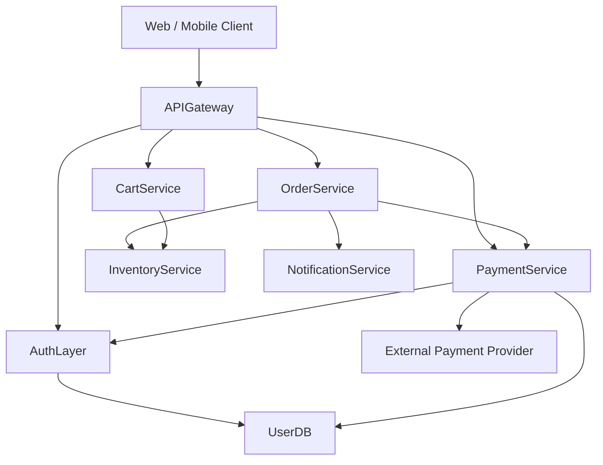

# ShopFlow Commerce Platform — Architecture Overview

ShopFlow is a fictional direct-to-consumer e-commerce platform built as a set of
independently deployable microservices. This document is the canonical reference
for service names, ownership, and the request flows that move a customer from
browsing to a completed purchase.

> **Naming convention (canonical):** Every service in this documentation set is
> referred to by its single canonical name (e.g. `PaymentService`). Operational
> data such as incident tickets, deploy logs, and dashboards may use abbreviated
> or legacy aliases — those should always resolve back to the canonical names
> defined here.

## Services

| Canonical Name        | Responsibility                                              | Owning Team      | Tech Lead       |
|-----------------------|-------------------------------------------------------------|------------------|-----------------|
| `APIGateway`          | Edge routing, TLS termination, rate limiting, auth handoff  | Platform         | Sam Patel       |
| `AuthLayer`           | Login, JWT issuance, token validation, session management   | Identity         | Priya Nair      |
| `UserDB`              | Authoritative store for accounts, credentials, profiles     | Platform         | Jordan Lee      |
| `PaymentService`      | Payment authorization, capture, refunds, PSP integration    | Payments Squad   | Alex Chen       |
| `OrderService`        | Order lifecycle, fulfillment orchestration                  | Checkout         | Maria Rodriguez |
| `CartService`         | Shopping cart state, pricing, promotions                    | Checkout         | Maria Rodriguez |
| `InventoryService`    | Stock levels, reservations, warehouse sync                  | Catalog          | Sam Patel       |
| `NotificationService` | Transactional email/SMS, order confirmations                | Growth           | Sam Patel       |

## System Diagram

## Checkout Request Flow

1. The client submits a checkout request through `APIGateway`.
2. `APIGateway` calls `AuthLayer` to validate the customer's JWT.
3. `AuthLayer` looks up the account and session state in `UserDB`.
4. `OrderService` creates a pending order and reserves stock via `InventoryService`.
5. `OrderService` calls `PaymentService` to authorize the charge.
6. `PaymentService` re-validates the token with `AuthLayer`, reads billing details
   from `UserDB`, and calls the external payment provider.
7. On success, `OrderService` confirms the order and `NotificationService` sends
   a confirmation email.

## Critical Shared Dependency

`UserDB` is a shared dependency of both `AuthLayer` and `PaymentService`. Because
these two services compete for the same database connection pool, a connection
leak in either service can starve the other. This coupling is the single most
important risk in the platform and is the subject of the dependency runbook
(see `05-service-dependencies-and-runbook.md`).
